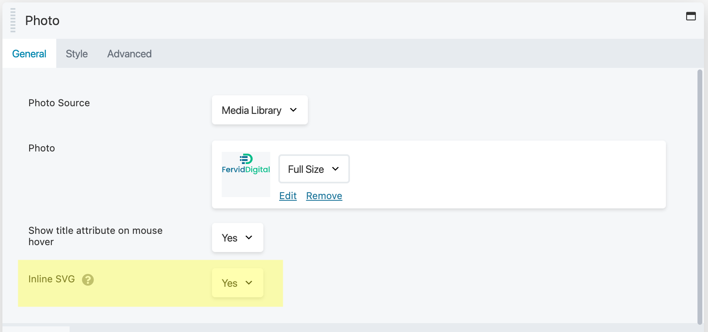

# Inline SVGs for Beaver Builder

Effortlessly upload and render SVGs directly within Beaver Builder Photo modules.

## Description

Tired of managing separate image files and code snippets for your SVGs in Beaver Builder?

Introducing Beaver SVG Inline, the plugin that streamlines your workflow by enabling uploading and direct inline rendering of SVGs within the Beaver Builder Photo module.

Simply upload your SVG file and it will be displayed beautifully, eliminating the need for external image URLs or custom code.

**Key benefits:**
- **Simplified Workflow**: No more juggling image files and code.
- **Perfect Solution**: Ideal for web designers and developers who want to leverage the power of SVGs within their Beaver Builder projects.

**Features:**
- Seamless integration with Beaver Builder Photo module.
- Supports all valid SVG code.
- Inherits styles and settings from the Photo module.
- Lightweight and efficient code for optimal performance.

Get started today and experience the ease of inline SVG rendering in Beaver Builder!

## Installation

1. Install the plugin either via the WordPress plugin directory or by uploading the files to your server at `wp-content/plugins`.
2. Activate the plugin through the 'Plugins' menu in WordPress.
3. That's it.

## Frequently Asked Questions

**Q: What's the requirement for using this plugin?**  
A: You must have Beaver Builder Installed.

**Q: Does this support all SVGs?**  
A: The plugin strives to support all valid SVG code. However, it's always recommended to test your specific SVGs to ensure proper rendering.

**Q: How does Beaver SVG Inline work?**  
A: When you upload an SVG file using the Beaver Builder Photo module with Inline SVGs for Beaver Builder activated, the plugin automatically adds the file to the Media Library and loads the contents of the SVG file into the page using JavaScript. You can edit the photo properties directly within the Beaver Builder editor just like any other image.

**Q: Where can I find more information or get support?**  
A: For further information or support, please refer to the plugin documentation or contact the plugin developer through the provided channels.

## Screenshots

  
*Beaver Builder Photo module General settings tab*

## Changelog

### 0.1.0
- Initial offering.

## License

- License: GPLv2 or later
- License URI: [GNU General Public License v2 or later](https://www.gnu.org/licenses/gpl-2.0.html)